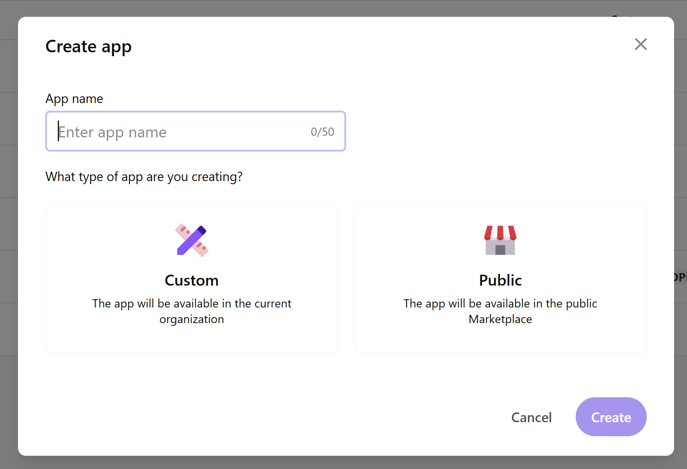
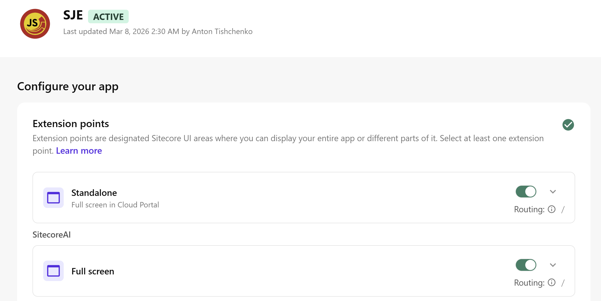
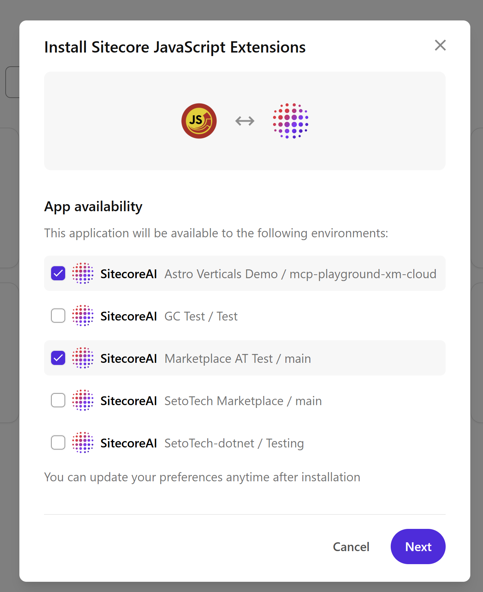

# Configuration

## Registering the App

To use Sitecore JavaScript Extensions with your Sitecore XM Cloud instance, register it as a custom app:

1. Log in to the [Sitecore Cloud Portal](https://portal.sitecorecloud.io/)
2. Navigate to **App Studio > Studio > Create app**
3. Enter **"Sitecore JavaScript Extensions"** as the app name
4. Select **Custom** as the app type
5. Click **Create**


## Extension Points

Enable the following extension points for the app:

- **Standalone** — Opens the IDE as a standalone app from the apps list
- **Full screen** — Opens the IDE in full-screen mode



## API Permissions

### Required

- **Sitecore APIs** — Access to content, templates, publishing, and other Sitecore APIs
- **AI skills APIs** — Required by the Sitecore Marketplace SDK

### Optional

- **Pop-ups** — If your scripts need to open pop-up windows
- **Copy to clipboard** / **Read from clipboard** — If your scripts interact with the clipboard

## Deployment URL

Set the **Deployment URL** to where your app is hosted:

- Local development: `http://localhost:3000`
- Production: Your deployed URL (e.g., `https://sitecore-hackathon-2026.netlify.app/`)

## Activating and Installing

1. Click **Activate** to activate the app
2. Go to **My apps** in the Cloud Portal
3. Find "Sitecore JavaScript Extensions" and click **Install**
4. Select the Sitecore instances where you want it installed
5. Review permissions and click **Install**



## Auto-Installed Sitecore Items

On first launch, the extension automatically creates the following items in your Sitecore content tree:

### Templates

Created under `/sitecore/templates/Modules/JavaScript Extensions/`:

| Template | Purpose |
|----------|---------|
| **JS Script Module** | Root module container with a `Version` field |
| **JS Script Library** | Folder for organizing scripts |
| **JS Script** | Individual script with a `Script` field |

### Content Tree

Created under `/sitecore/system/Modules/JavaScript Extensions/`:

```
JavaScript Extensions        (JS Script Module)
  └── Script Library          (JS Script Library)
       ├── Examples            (JS Script Library, read-only built-in scripts)
       └── User Scripts        (JS Script Library, your saved scripts)
```

## Module Versioning

The extension tracks a module version (currently `1.8.5`). When the app detects an upgrade:

- The **Examples** folder is deleted and recreated with updated example scripts
- **User Scripts** are preserved — your saved scripts are never deleted
- The version field on the module root is updated

## localStorage Fallback

If the Sitecore item installation fails (e.g., due to permissions), the extension falls back to **localStorage** for script storage. Scripts saved in localStorage mode are only available in the current browser.
