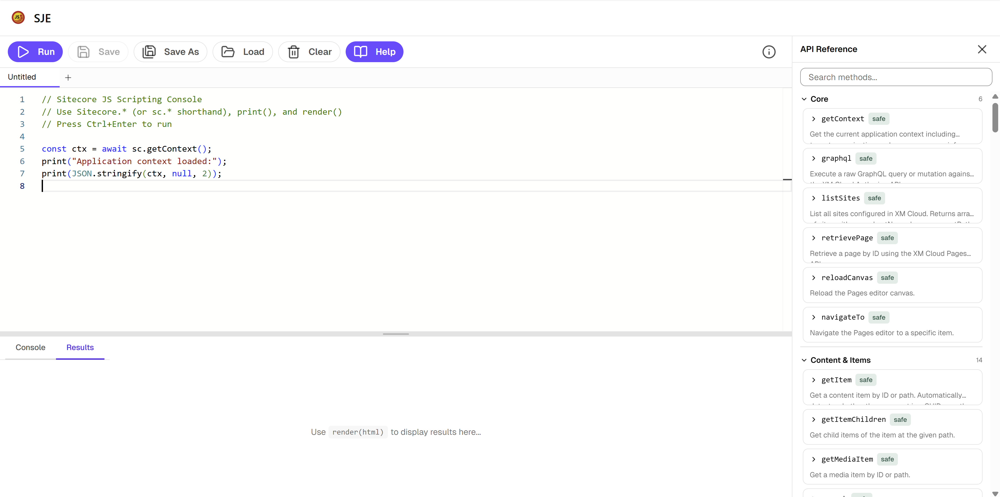
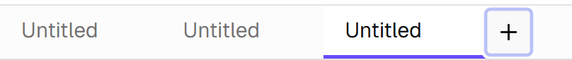
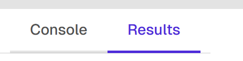

# Getting Started

Sitecore JavaScript Extensions is a modern reimagining of [Sitecore PowerShell Extensions](https://doc.sitecorepowershell.com/) — built with React, TypeScript, and Monaco Editor, running as a Sitecore Marketplace app in the cloud.

Write and execute JavaScript to automate tasks, manipulate content, manage templates, publish, and more — all from within Sitecore XM Cloud.



## UI Overview

The IDE consists of:

- **Toolbar** — Run, Save, Load, Help, and tab management
- **Editor tabs** — Multiple scripts open side-by-side, powered by Monaco Editor with JS syntax highlighting and autocomplete
- **Console tab** — Text output from `print()`, `console.log()`, and errors
- **Results tab** — Rich HTML output from `render()` and display helpers





## Quick Start

1. Open Sitecore JavaScript Extensions from your apps list in Sitecore Cloud Portal
2. Type JavaScript in the editor:
   ```js
   const item = await sc.Content.getItem("/sitecore/content/Home");
   printItem(item);
   ```
3. Press **Ctrl+Enter** (or click the Run button) to execute
4. View the output in the Console or Results tab

## Available Globals

Every script has access to these built-in globals:

| Global | Description |
|--------|-------------|
| `Sitecore` / `sc` | API client with 9 namespaces (Content, Publishing, Templates, etc.) and 100+ methods |
| `print(...args)` | Output text to the Console tab |
| `render(html)` | Output HTML to the Results tab |
| `console.log/warn/error/info` | Standard console methods, captured in Console tab |
| `help(query?)` | In-script help — browse categories, search methods |
| `printItem` / `renderItem` | Formatted item display |
| `printUser` / `renderUser` | Formatted user display |
| `printRole` / `renderRole` | Formatted role display |
| `printTemplate` / `renderTemplate` | Formatted template display |

## Next Steps

- [Installation](./installation) — Set up the project locally or deploy to production
- [Configuration](./configuration) — Register and configure the app in Sitecore Cloud Portal
- [Running Scripts](./running-scripts) — Learn about the execution environment
- [Output Functions](./output-functions) — Detailed reference for print, render, and display helpers
- [Using Help](./using-help) — Explore the built-in API reference
