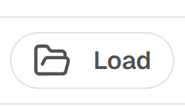
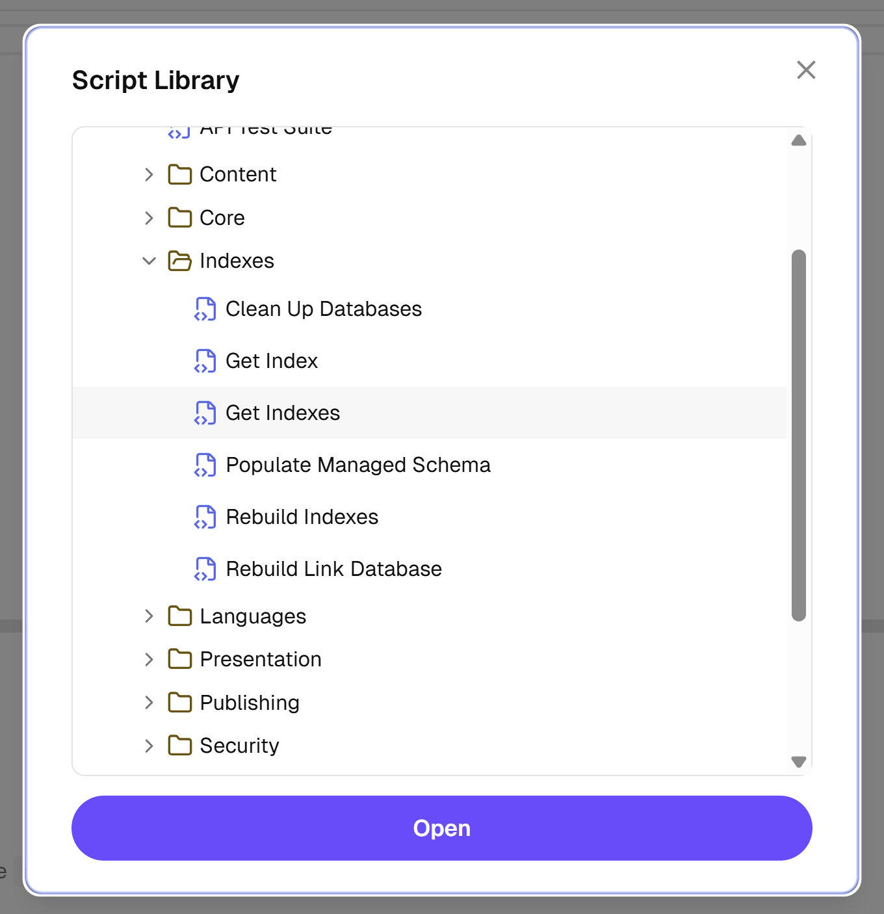
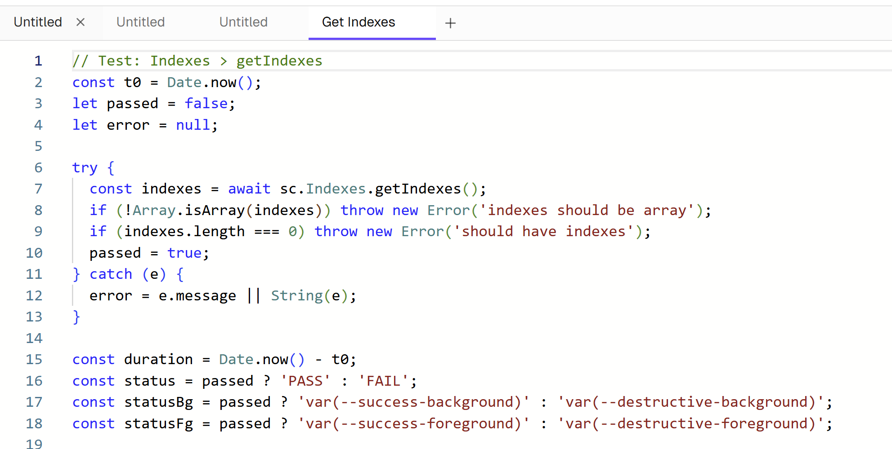

# Loading Scripts

## Opening the Script Library

Click the **Load** button in the toolbar to open the Script Library dialog.

## Script Library Tree

The Script Library is organized as a tree with two top-level folders:

- **Examples** — Built-in example scripts that ship with the extension. These are read-only and are updated automatically when the module version changes.
- **User Scripts** — Scripts you have saved. These are preserved across module upgrades.

## Selecting a Script

1. Click the **Load** button to open the Script Library
2. Browse the tree and select a script
3. Click **Open** (or double-click the script)

The script opens in a new editor tab. The tab is linked to the saved script, so you can later use **Save** to update it in place.

## Notes

- If Sitecore item storage is unavailable, scripts are loaded from localStorage instead
- Example scripts are a good starting point for learning the available APIs
- You can have multiple scripts open in separate tabs at the same time
