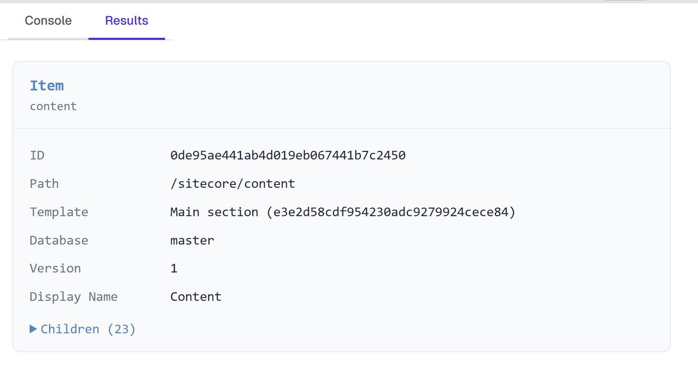
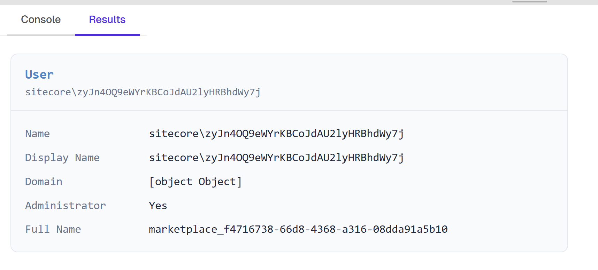
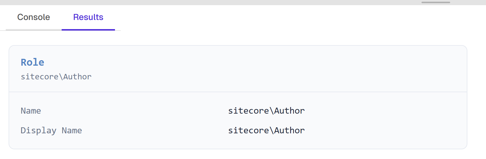

# Output Functions

Scripts have several built-in functions for displaying output. Text-based functions write to the **Console** tab; HTML-based functions write to the **Results** tab.

## `print(...args)`

Outputs one or more values to the Console tab. Objects are automatically JSON-serialized with indentation.

```js
print("Hello, world!");
print("Item count:", 42);
print({ name: "Home", path: "/sitecore/content/Home" });
```

## `render(html)`

Sets the HTML content of the Results tab. Each call **replaces** the previous content.

```js
render("<h1>Hello</h1><p>This is rendered HTML</p>");
```

```js
// Build a table
const items = await sc.Content.getItemChildren("/sitecore/content/Home");
const rows = items.map(i => `<tr><td>${i.name}</td><td>${i.path}</td></tr>`).join("");
render(`<table><tr><th>Name</th><th>Path</th></tr>${rows}</table>`);
```

## `console.log()` / `warn()` / `error()` / `info()`

Standard console methods are captured and displayed in the Console tab with level badges:

```js
console.log("Information message");
console.warn("Warning: something may be wrong");
console.error("Error: something failed");
console.info("Informational note");
```

Each entry shows a colored badge indicating the level (log, warn, error, info).

## `printItem(item)` / `renderItem(item)`

Formatted display for Sitecore items.

**`printItem`** outputs a structured text block to Console:

```js
const item = await sc.Content.getItem("/sitecore/content/Home");
printItem(item);
```

Output:
```
Item: Home
  ID:         {110D559F-DEA5-42EA-9C1C-8A5DF7E70EF9}
  Path:       /sitecore/content/Home
  Template:   Sample Item ({76036F5E-CBCE-46D1-AF0A-4143F9B557AA})
  Database:   master
  Fields:
    Title    = "Welcome to Sitecore"
```

**`renderItem`** outputs a styled HTML card to Results:

```js
const item = await sc.Content.getItem("/sitecore/content/Home");
renderItem(item);
```



## `printUser(user)` / `renderUser(user)`

Formatted display for Sitecore users.

```js
const user = await sc.Security.getCurrentUser();
printUser(user);
```

Output:
```
User: sitecore\admin
  Display:    Administrator
  Domain:     sitecore
  Admin:      Yes
  Roles (2):
    sitecore\Sitecore Client Authoring
    sitecore\Sitecore Client Publishing
```

```js
const user = await sc.Security.getCurrentUser();
renderUser(user);
```



## `printRole(role)` / `renderRole(role)`

Formatted display for Sitecore roles.

```js
const roles = await sc.Security.getRoles();
printRole(roles[0]);
```

Output:
```
Role: sitecore\Author
  Members (3):
    sitecore\user1
    sitecore\user2
    sitecore\user3
```

```js
const roles = await sc.Security.getRoles();
renderRole(roles[0]);
```



## `printTemplate(template)` / `renderTemplate(template)`

Formatted display for Sitecore templates.

```js
const tmpl = await sc.Templates.getTemplate("/sitecore/templates/Sample/Sample Item");
printTemplate(tmpl);
```

Output:
```
Template: Sample Item
  ID:         {76036F5E-CBCE-46D1-AF0A-4143F9B557AA}
  Path:       /sitecore/templates/Sample/Sample Item
  Fields (3):
    Title (Single-Line Text) [Data]
    Text (Rich Text) [Data]
    Image (Image) [Data]
```

```js
const tmpl = await sc.Templates.getTemplate("/sitecore/templates/Sample/Sample Item");
renderTemplate(tmpl);
```
