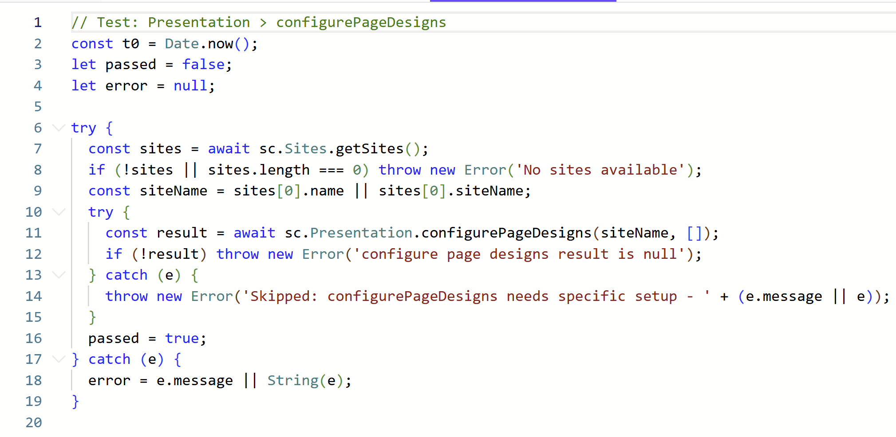
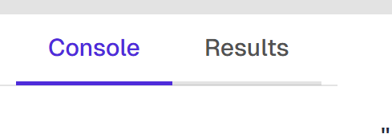

# Running Scripts

## The Editor

The script editor is powered by [Monaco Editor](https://microsoft.github.io/monaco-editor/) (the same editor used in VS Code), providing:

- JavaScript syntax highlighting
- Autocomplete and IntelliSense
- Multiple editor tabs for working with several scripts at once



## Executing Scripts

Run your script by pressing **Ctrl+Enter** or clicking the **Run** button in the toolbar.


## Top-Level Await

Scripts support top-level `await` — no need to wrap your code in an async function:

```js
const item = await sc.Content.getItem("/sitecore/content/Home");
print(item.name);
```

## Available Globals

Every script has access to these built-in variables and functions:

### `Sitecore` / `sc`

The main API client, organized into 9 namespaces with 100+ methods:

| Namespace | Examples |
|-----------|----------|
| `sc.Content` | `getItem`, `createItem`, `updateItem`, `deleteItem`, `search` |
| `sc.Publishing` | `publishItem`, `publishSite`, `getPublishingStatus` |
| `sc.Templates` | `getTemplate`, `createTemplate`, `getTemplates` |
| `sc.Sites` | `getSite`, `getSites`, `createSite` |
| `sc.Security` | `getCurrentUser`, `getUsers`, `getRoles` |
| `sc.Workflows` | `getWorkflows`, `startWorkflow`, `executeWorkflowCommand` |
| `sc.Indexes` | `getIndexes`, `rebuildIndexes` |
| `sc.Languages` | `getLanguages`, `addLanguage` |
| `sc.Translation` | `translatePage`, `translateSite` |

All methods on `sc` are also available directly (e.g., `sc.getItem(...)` works the same as `sc.Content.getItem(...)`).

### Output Functions

| Function | Output Target |
|----------|---------------|
| `print(...args)` | Console tab |
| `render(html)` | Results tab |
| `console.log/warn/error/info` | Console tab (with level badges) |
| `printItem(item)` | Console tab (formatted) |
| `renderItem(item)` | Results tab (rich HTML card) |
| `printUser`, `renderUser` | Formatted user display |
| `printRole`, `renderRole` | Formatted role display |
| `printTemplate`, `renderTemplate` | Formatted template display |

See [Output Functions](./output-functions) for detailed documentation.

### `help(query?)`

In-script help system. See [Using Help](./using-help) for details.

## Error Handling

If a script throws an error, the error message and stack trace are displayed in the **Console** tab with an error badge. The script stops executing at the point of the error.

```js
// This will show an error in Console:
const item = await sc.Content.getItem("/nonexistent/path");
print(item.name); // Error if item is null
```

## Output Tabs

- **Console** — Shows text output from `print()`, `console.*` calls, and errors. Each entry has a timestamp and level badge.
- **Results** — Shows HTML output from `render()` and the rich display helpers (`renderItem`, `renderUser`, etc.). Each `render()` call replaces the previous content.


