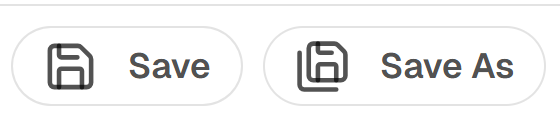
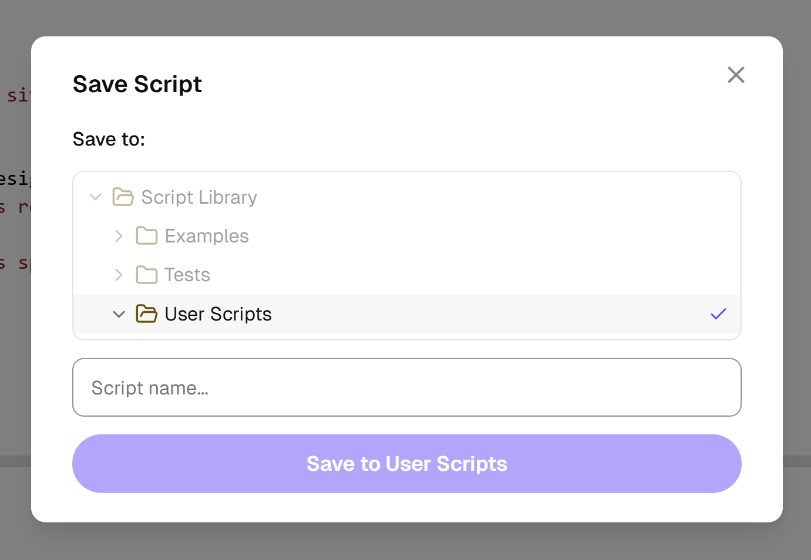

# Saving Scripts

## Save

The **Save** button updates the currently linked script — the script you opened from the Script Library or previously saved with Save As.

- If the current tab is not linked to a saved script (e.g., a new untitled script), the Save button is disabled
- Use **Save As** instead to save a new script



## Save As

The **Save As** button opens the Save dialog, allowing you to save the current script as a new entry in User Scripts.

1. Click **Save As** in the toolbar
2. The Script Library tree is shown — navigate to the **User Scripts** folder
3. Enter a name for your script
4. Click **Save**



## Overwrite Detection

If you enter a name that matches an existing script in the same folder, the extension will detect the conflict and prompt you to confirm the overwrite.

## Where Scripts Are Stored

Scripts are saved as Sitecore items under:

```
/sitecore/system/Modules/JavaScript Extensions/Script Library/User Scripts/
```

Each script is a **JS Script** item with a `Script` field containing your code.

If Sitecore item storage is unavailable, scripts are saved to **localStorage** as a fallback.
