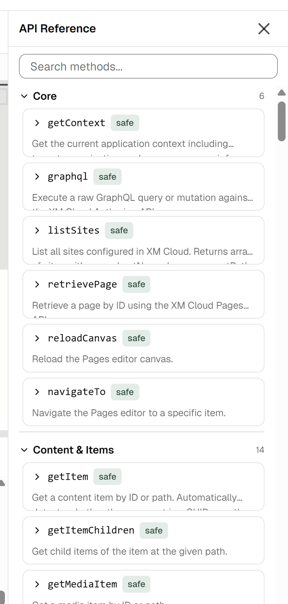
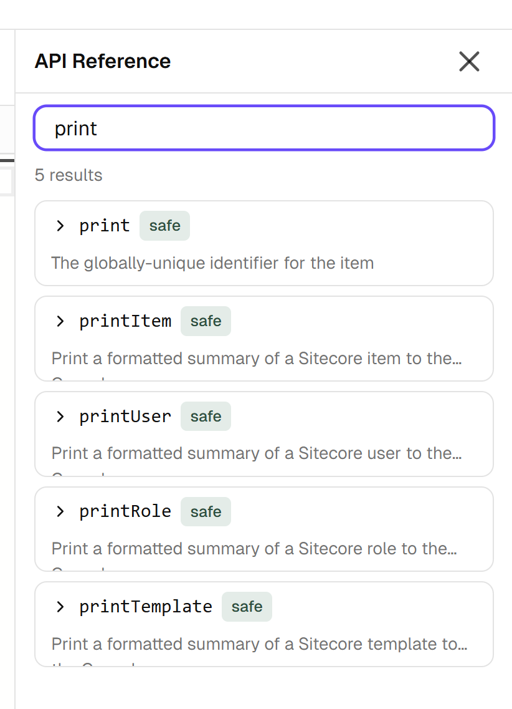
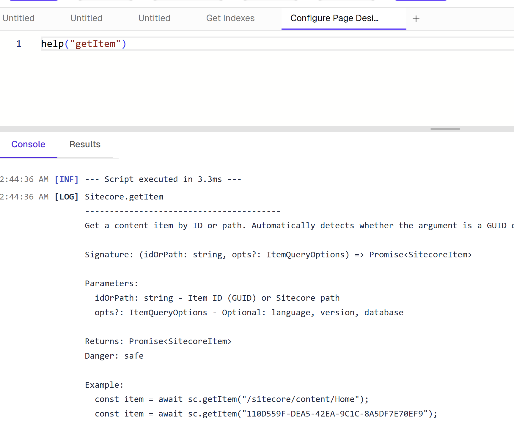

# Using Help

## Help Panel

Toggle the Help panel by clicking the **Help** button in the toolbar. The panel opens on the right side of the editor.



## Browsing by Category

The Help panel organizes all available API methods into categories:

| Category | Description |
|----------|-------------|
| Content | Item CRUD, search, media, versioning |
| Publishing | Publish items, sites, check status |
| Indexes | Search indexes, link database, schema |
| Workflows | Workflow management and execution |
| Translation | Page and site translation |
| Templates | Template CRUD, folders, data sources |
| Sites | Site and collection management |
| Languages | Language management, archiving |
| Security | Users, roles, domains, permissions |
| Presentation | Renderings, page designs, databases |

Click a category to expand it and see all methods.

## Searching

Use the **search box** at the top of the Help panel to filter methods. The search matches against method names and descriptions, so you can search for both specific method names (e.g., "getItem") and concepts (e.g., "publish").



## Method Cards

Each method is displayed as a card showing:

- **Qualified name** — e.g., `Sitecore.Content.getItem`
- **Signature** — Parameters and types
- **Description** — What the method does
- **Parameters** — Name, type, and description for each parameter
- **Return type** — What the method returns



## Danger Levels

Methods are tagged with a danger level indicating their impact:

| Level | Color | Meaning |
|-------|-------|---------|
| **safe** | Green | Read-only operation, no side effects |
| **mutating** | Yellow | Modifies data (create, update) |
| **destructive** | Red | Deletes data or performs irreversible operations |

## Insert Snippet

Each method card has an **Insert** button that copies a code snippet for that method into the editor, giving you a ready-to-use starting point.

## `help()` Function in Scripts

You can also access help programmatically from within your scripts:

```js
// Overview: list all categories and method counts
help();

// Details for a specific method
help("getItem");

// All methods in a category
help("Content");

// Search across method names and descriptions
help("publish");
```

The output is printed to the Console tab.
